# Bezpečnosť elektronickej pošty a SMTP komunikácie

Tento projekt sa zameriava na praktickú analýzu bezpečnostných slabín SMTP komunikácie
na úrovni prenosu, autentifikácie a politiky relaying-u.

Projekt **nerieši SPF, DKIM ani DMARC** a nezameriava sa na autentifikáciu identity
odosielateľa pomocou DNS mechanizmov. Cieľom je analyzovať bezpečnosť SMTP servera
z pohľadu komunikácie medzi klientom a MTA.

## Úvod k SMTP protokolu
### Historický kontext
Protokol SMTP (Simple Mail Transfer Protocol) bol štandardizovaný začiatkom 80. rokov minulého storočia (RFC 821, neskôr RFC 5321) v období, keď počítačové siete fungovali prevažne v akademickom a výskumnom prostredí. Tieto siete boli malé, uzavreté a založené na vzájomnej dôvere medzi jednotlivými uzlami.

### Pôvodné návrhové predpoklady
SMTP bol navrhnutý ako jednoduchý prenosový protokol, ktorý predpokladá korektné správanie zúčastnených strán. Protokol neobsahuje natívne mechanizmy na autentifikáciu odosielateľa, šifrovanie komunikácie ani ochranu pred zneužitím.

### Vývoj bezpečnostných rozšírení
S rastúcim významom elektronickej pošty a zmenou bezpečnostného prostredia boli postupne zavedené viaceré bezpečnostné mechanizmy, ako napríklad SMTP AUTH, STARTTLS, SPF, DKIM a DMARC. Tieto mechanizmy výrazne zvyšujú úroveň bezpečnosti e-mailovej komunikácie.

### Hop-based model a jeho dôsledky
Napriek týmto rozšíreniam zostáva SMTP komunikácia založená na tzv. hop-based modeli. To znamená, že bezpečnostné vlastnosti sa uplatňujú vždy len medzi dvoma konkrétnymi účastníkmi komunikácie (napr. klient → server alebo server → server), nie naprieč celým reťazcom doručenia správy.

## Praktická časť – Analýza SMTP komunikácie
### 1. Architektúra testovacieho prostredia
#### 1.1. Cieľ infraštruktúry
Cieľom testovacieho prostredia je simulovať realistický scenár SMTP komunikácie, kde:
- klient/útočník komunikuje so SMTP submission serverom
- SMTP server následne relaye správu do reálneho e-mailového systému
- demonštruje sa, že slabina v prvom kroku môže viesť k doručeniu e-mailu koncovému používateľovi
#### 1.2. Logická architektúra
Pre účely demonštrácie bezpečnostných slabín SMTP protokolu je testovacie
prostredie navrhnuté tak, aby Postfix server vystupoval voči cieľovému
mailovému systému (Gmail) v roli SMTP klienta, nie ako plnohodnotný
server-to-server MTA.

Ak by Postfix v tomto scenári figuroval ako verejne dostupný SMTP server,
bolo by nevyhnutné riešiť ďalšie mechanizmy, ako sú verejná IP adresa,
PTR záznamy, SPF a DKIM politiky, reputácia servera a ďalšie ochranné
mechanizmy používané modernými poskytovateľmi e-mailových služieb.
Tieto mechanizmy by výrazne ovplyvnili výsledky experimentov a znemožnili
jednoznačnú demonštráciu slabín samotného SMTP protokolu.
```
REÁLNE PROSTREDIE (server ↔ server)           LAB SCENÁR (klient → Postfix → Gmail)

┌──────────────────┐                         ┌──────────────────┐
│  Mailový klient  │                         │ Klient / Útočník │
│ (Outlook, web)   │                         │     (telnet)     │
└─────────┬────────┘                         └─────────┬────────┘
          │ SMTP (587)                                 │ SMTP (587)
          │                                            │ 
          ▼                                            ▼
┌──────────────────┐                         ┌──────────────────┐
│   SMTP server    │                         │ Postfix SMTP MTA │
│                  │                         │    (Docker)      │
└─────────┬────────┘                         └─────────┬────────┘
          │ server ↔ server SMTP (port 25)             │ klient → server SMTP (port 587)
          │ bez loginu                                 │ AUTH (gmail účet)
          │                                            │
          │ Overenie:                                  │ Overenie:
          │ - verejná IP                               │ - SMTP AUTH (login/heslo)
          │ - PTR / SPF                                │ - STARTTLS
          │ - DKIM                                     │
          │ - reputácia                                │
          ▼                                            ▼
┌──────────────────┐                         ┌──────────────────┐
│ SMTP server      │                         │ smtp.gmail.com   │
│                  │                         │      :587        │
└─────────┬────────┘                         └─────────┬────────┘
          ▼                                            ▼
┌──────────────────┐                         ┌──────────────────┐
│ Príjemca e-mailu │                         │ Inbox príjemcu   │
│                  │                         │   (Gmail UI)     │
└──────────────────┘                         └──────────────────┘
```
### 2. Použité technológie a nástroje
#### 2.1. Docker Compose
Docker Compose bol použitý na:
- rýchle nasadenie SMTP servera
- izoláciu testovacieho prostredia
- jednoduché opakovanie experimentov

#### 2.2. Postfix SMTP server
Postfix bol zvolený ako:
- reálne používaný SMTP server
- plne konfigurovateľný MTA
- vhodný na demonštráciu nesprávnych konfigurácií
- použitý image - **boky/postfix**

#### 2.3. Gmail SMTP Relay
Na odosielanie e-mailov do reálneho inboxu bol použitý Gmail SMTP relay.
Postup:
- vytvorenie účtu (alebo použitie existujúceho)
- generovanie App Password pre SMTP prístup
- konfigurácia Postfix relay hosta

#### 2.4. Telnet
Telnet bol použitý ako:
- jednoduchý TCP klient
- nástroj na manuálne odosielanie SMTP príkazov
- spôsob demonštrácie plaintext komunikácie

#### 2.5. Wireshark
Wireshark bol použitý na:
- zachytávanie SMTP komunikácie
- demonštráciu plaintext prenosu údajov
- porovnanie komunikácie pred a po zapnutí TLS

#### 2.6. Mozilla Thunderbird
Mozilla Thunderbird bol použitý ako plnohodnotný e-mailový klient na simuláciu
legitímneho používateľa, ktorý sa autentifikuje voči SMTP serveru pomocou mena
a hesla.

### 3. Scenáre útokov a testovania
#### 3.1. Scenár 1 - Open relay (nesprávna politika relaying-u)
V tomto scenári demonštrujeme bezpečnostnú slabinu spôsobenú nesprávne
nastavenou politikou relaying-u, pri ktorej server dôveruje širokému rozsahu
IP adries a nevyžaduje autentifikáciu od klienta.

Postfix server je nakonfigurovaný tak, že všetky spojenia pochádzajúce
z IP adries definovaných v parametri `mynetworks` sú považované za dôveryhodné.
Takýto prístup umožňuje odosielanie e-mailov bez použitia mechanizmu SMTP AUTH,
čo v praxi vedie k správaniu typu open relay.

```
# docker-compose.yml

services:
  postfix:
    image: boky/postfix
    container_name: postfix-gmail
    restart: unless-stopped
    ports:
      - "25:25"
      - "587:587"
    environment:
      # Spam friendly
      ALLOW_EMPTY_SENDER_DOMAINS: "yes"

      POSTFIX_mynetworks: "192.168.0.0/16, 172.16.0.0/12, 172.18.0.0/16"

      # Classic open relay logic
      POSTFIX_smtpd_relay_restrictions: "permit_mynetworks,reject_unauth_destination"
      POSTFIX_smtpd_recipient_restrictions: "permit_mynetworks,reject"

      # Postfix -> Gmail relay settings
      RELAYHOST: "[smtp.gmail.com]:587"
      RELAYHOST_USERNAME: "${GMAIL_USER}"
      RELAYHOST_PASSWORD: "${GMAIL_PASSWORD}"
      RELAYHOST_TLS_LEVEL: "encrypt"
```

Po spustení SMTP servera sa útočník pripojí na submission port (587) pomocou
nástroja telnet a manuálne vykoná štandardnú SMTP konverzáciu. 

```
# terminál/príkazový riadok

telnet 192.168.0.52 587

EHLO bit.demo
MAIL FROM:<bitdemo25@gmail.com>
RCPT TO:<xvaliceks@stuba.sk>
DATA
To: xvaliceks@stuba.sk
From: bitdemo25@gmail.com
Subject: Step 1

Toto je krok cislo 1 v nasom deme
.
QUIT
```

Server akceptuje
príkazy `MAIL FROM` a `RCPT TO` bez požiadavky na autentifikáciu a následne
relayne správu do externého mailového systému.

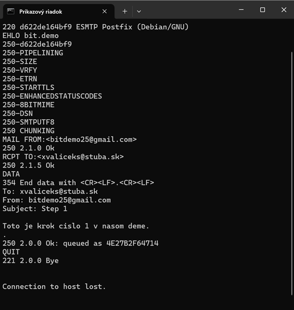

Výsledkom je úspešné doručenie e-mailu do schránky koncového používateľa
bez akejkoľvek formy overenia odosielateľa. Pri danej konfigurácii môže tento
typ zneužitia vykonať ktokoľvek s prístupom do siete, v ktorej sa server nachádza.

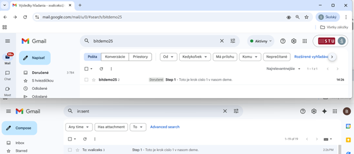

#### 3.2. Scenár 2 – Vynútenie autentifikácie (AUTH)
V tomto scenári demonštrujeme zavedenie mechanizmu SMTP AUTH ako reakciu na
nesprávnu politiku relaying-u z predchádzajúceho scenára. Cieľom je zabrániť
neautorizovanému odosielaniu e-mailov vypnutím dôvery voči IP adresám a
vynútením autentifikácie používateľa.

Postfix server je nakonfigurovaný tak, aby umožňoval relaying iba
autentifikovaným klientom. Spojenia pochádzajúce z nedôveryhodných IP adries
sú bez platných prihlasovacích údajov odmietnuté. Týmto nastavením je
eliminované správanie typu open relay.

```
# docker-compose.yml

services:
  postfix:
    image: boky/postfix
    container_name: postfix-gmail
    restart: unless-stopped
    ports:
      - "25:25"
      - "587:587"
    environment:
      # Spam friendly
      ALLOW_EMPTY_SENDER_DOMAINS: "yes"

      POSTFIX_mynetworks: "127.0.0.0/8, 172.16.0.0/12"

      # Require SMTP authentication
      POSTFIX_smtpd_sasl_auth_enable: "yes"
      POSTFIX_smtpd_sasl_security_options: "noanonymous"
      POSTFIX_smtpd_sasl_local_domain: ""

      # Relay policy: auth required for non-local domains
      POSTFIX_smtpd_relay_restrictions: "permit_sasl_authenticated,reject_unauth_destination"
      POSTFIX_smtpd_recipient_restrictions: "permit_sasl_authenticated,reject"

      # Postfix -> Gmail relay settings
      RELAYHOST: "[smtp.gmail.com]:587"
      RELAYHOST_USERNAME: "${GMAIL_USER}"
      RELAYHOST_PASSWORD: "${GMAIL_PASSWORD}"
      RELAYHOST_TLS_LEVEL: "encrypt"
```

Následne inicializujeme databázu vo vnútri Postfix kontajnera, na základe ktorej sa vytvorí lokálny používateľ v SASL databáze Postfix servera. Tento používateľ slúži na simuláciu legitímneho SMTP klienta.
  
```
# terminál/príkazový riadok

docker exec -it postfix-gmail sh


rm -f /etc/sasldb2
rm -f /var/spool/postfix/etc/sasldb2
HOST=$(postconf -h myhostname)
echo $HOST

# vytvoríme usera mario
saslpasswd2 -c -u "$HOST" mario

# dostaneme výzvu na zadanie hesla, kde 'krokodil123' bude naše heslo
krokodil123

mkdir -p /var/spool/postfix/etc
cp /etc/sasldb2 /var/spool/postfix/etc/sasldb2
chown postfix:postfix /etc/sasldb2
chmod 600 /etc/sasldb2
chown postfix:postfix /var/spool/postfix/etc/sasldb2
chmod 600 /var/spool/postfix/etc/sasldb2

postfix stop
postfix start
```

Pokúsime sa "zaútočiť" na server rovnako, ako v predošlom kroku.

```
# terminál/príkazový riadok

telnet 192.168.0.52 587

EHLO bit.demo
MAIL FROM:<bitdemo25@gmail.com>
RCPT TO:<xvaliceks@stuba.sk>
DATA
To: xvaliceks@stuba.sk
From: bitdemo25@gmail.com
Subject: Step 2

Toto je krok cislo 2 v nasom deme
.
QUIT
```

Po aplikovaní konfigurácie sa najprv overí, že pokus o odoslanie e-mailu
bez autentifikácie je serverom zamietnutý. SMTP server v tomto prípade
vyžaduje úspešné overenie používateľa prostredníctvom mechanizmu SMTP AUTH.


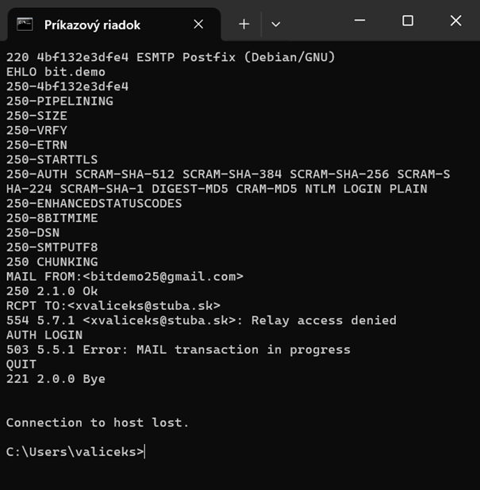

Pokúsime sa teda, prihlásiť pomocou údajov, ktoré sme si vytvorili vyššie v databáze vo vnútri kontajnera.
V našom prípade, to budú údaje username:password → mario:krokodil123. Na prihlásenie sa do účtu použijeme klienta Mozilla Thunderbird. 

Po úspešnom prihlásení sa do Mozilly Thunderbird, pošleme skúšobný e-mail.

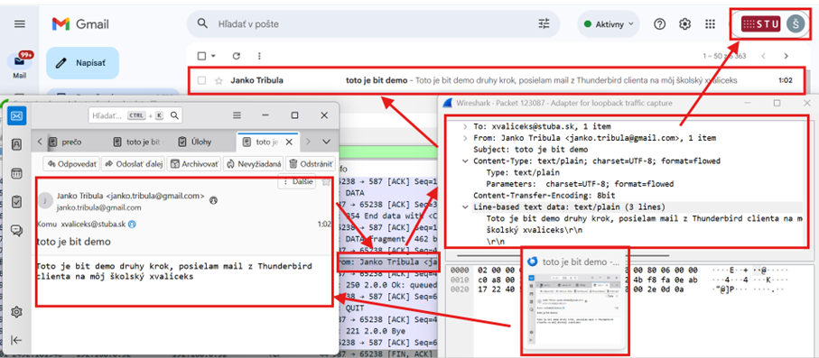

Ako vidíme na obrázku vyššie, e-mail bol po autentifikácii odoslaný úspešne. Teraz sa pokúsime simulovať správanie útočníka a odchytiť nešifrovanú komunikáciu, spolu s prihlasovacími údajmi.

Otvoríme si Wireshark, vyberieme príslušnú sieť a zadáme filter **smtp || tcp.port == 587**

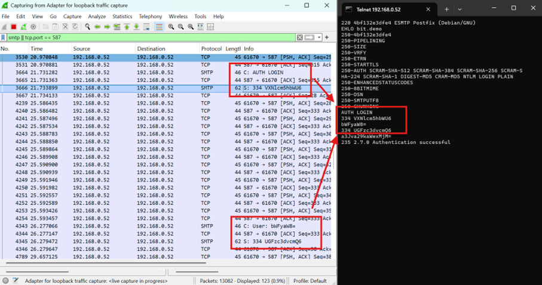
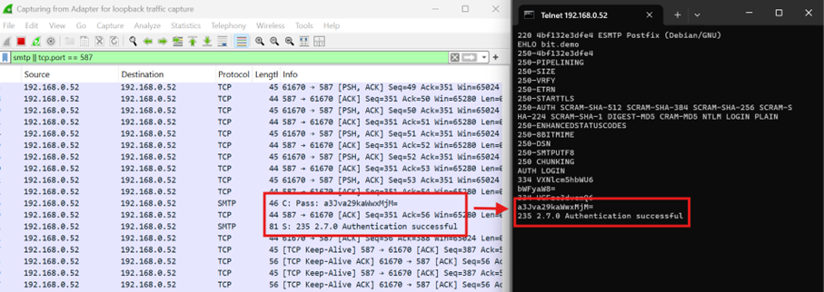
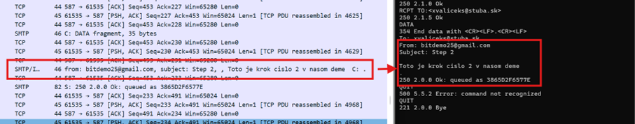

Tieto údaje sú zakódované v base64, čo nám ale vôbec nevadí, nakoľko ich budeme prostredníctvom telnetu zakódované zadávať do terminálu. Pre demonštráciu toho, že sa jedná o tie isté údaje, si ich však dekódujeme.

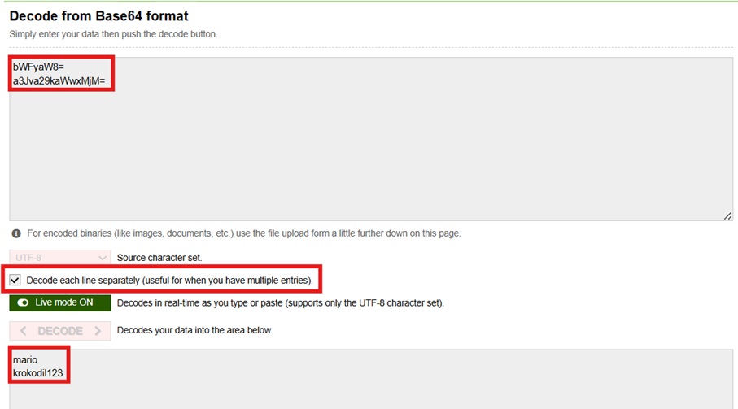

Následne, keď máme zachytené (aj dekódované) prihlasovacie údaje, pokúsime sa simulovať správanie útočníka a použijeme ich pri prihlasovaní telnetom. Musíme mať však na pamäti, že prostredníctvom telnetu dostaneme výzvu na zadanie mena a hesla zakódovanú v base64, a rovnako tak musia byť zakódované prihlasovacie údaje, keď ich do terminálu zapisujeme (to sú tie "divné" dva riadky po AUTH LOGIN).

```
# terminál/príkazový riadok

telnet 192.168.0.52 587

EHLO bit.demo
AUTH LOGIN
bWFyaW8=
a3Jva29kaWwxMjM=
MAIL FROM:<bitdemo25@gmail.com>
RCPT TO:<xvaliceks@stuba.sk>
DATA
To: xvaliceks@stuba.sk
From: bitdemo25@gmail.com
Subject: Step 2

Toto je krok cislo 2 v nasom deme
.
QUIT
```

"Útok" prostredníctvom telnetu prebehol úspešne, čo malo za následok doručený e-mail v inboxe obete.

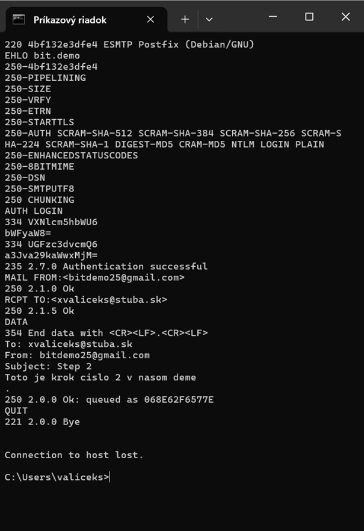
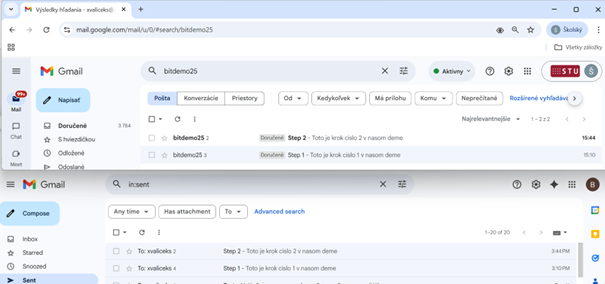


#### 3.3. Scenár 3 – Chýbajúce TLS (cleartext credentials)
V tomto kroku sa zameriavame na vynútenie šifrovania SMTP komunikácie pomocou TLS.
Cieľom je zabrániť autentifikácii používateľa v prípade, že spojenie nie je
zabezpečené mechanizmom STARTTLS.

V nasledujúcej konfigurácii je TLS povinné pre SMTP submission službu (port 587)
a autentifikácia je povolená až po úspešnom nadviazaní šifrovaného spojenia.
```
services:
  postfix:
    image: boky/postfix
    container_name: postfix-gmail
    restart: unless-stopped
    ports:
      - "587:587"
    environment:
      # Spam friendly
      ALLOW_EMPTY_SENDER_DOMAINS: "yes"

      POSTFIX_mynetworks: "192.168.0.0/16, 127.0.0.0/8, 172.16.0.0/12"

      # GLOBAL smtpd settings
      POSTFIX_smtpd_sasl_auth_enable: "yes"
      POSTFIX_smtpd_tls_auth_only: "yes"
     
      # Submission service (587)
      ENABLE_SUBMISSION: "yes"
      POSTFIX_submission_smtpd_tls_security_level: "encrypt"
      POSTFIX_submission_smtpd_tls_auth_only: "yes"
      POSTFIX_submission_smtpd_sasl_auth_enable: "yes"
      POSTFIX_submission_smtpd_relay_restrictions: "permit_sasl_authenticated,reject"

      # Gmail relay
      RELAYHOST: "[smtp.gmail.com]:587"
      RELAYHOST_USERNAME: "${GMAIL_USER}"
      RELAYHOST_PASSWORD: "${GMAIL_PASSWORD}"
      POSTFIX_smtp_tls_security_level: "encrypt"
```

Po aplikovaní konfigurácie sa pokúsime o autentifikáciu rovnakým spôsobom
ako v predchádzajúcom scenári. Pri použití nástroja telnet server v odpovedi
neponúkne možnosť mechanizmu AUTH, čím signalizuje, že autentifikácia je
podmienená aktívnym TLS spojením.

```
# terminál/príkazový riadok

telnet 192.168.0.52 587

EHLO bit.demo
AUTH LOGIN
bWFyaW8=
a3Jva29kaWwxMjM=
```

Pri použití nástroja telnet server v odpovedi
neponúkne možnosť mechanizmu AUTH, čím signalizuje, že autentifikácia je
podmienená aktívnym TLS spojením. 

Keďže telnet nepodporuje nadviazanie šifrovaného spojenia pomocou STARTTLS,
pokus o autentifikáciu zlyhá. Tento stav potvrdzuje, že server správne
vynucuje bezpečnostné vlastnosti spojenia.

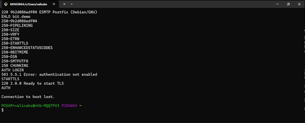

Na nadviazanie šifrovaného spojenia preto použijeme nástroj `openssl`,
ktorý umožňuje inicializovať SMTP komunikáciu so zapnutým STARTTLS.

```
# GitBash

openssl s_client -starttls smtp -connect 192.168.0.52:587
```

Po úspešnom nadviazaní šifrovaného spojenia server sprístupní autentifikačné
mechanizmy, ktoré boli v predchádzajúcom prípade nedostupné.

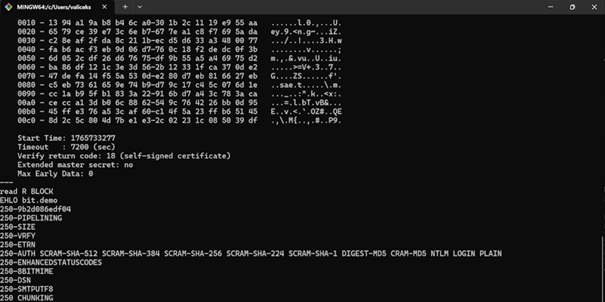

Opäť sa prihlásime.

```
AUTH LOGIN
bWFyaW8=
a3Jva29kaWwxMjM=
```

Po úspešnej autentifikácii je komunikácia medzi klientom a SMTP serverom
chránená pomocou TLS (TLSv1.3). Zachytené pakety vo Wiresharku sú šifrované
a neumožňujú jednoduché odčítanie obsahu ani prihlasovacích údajov, čím je
odstránená slabina demonštrovaná v predchádzajúcom scenári.

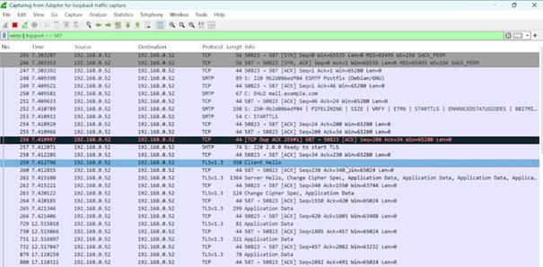


## Záver
Praktická časť práce ukazuje, že moderné e-mailové systémy sú vo väčšine prípadov správne zabezpečené a dokážu efektívne eliminovať známe slabiny SMTP protokolu. Zároveň však demonštruje, že tieto mechanizmy fungujú len v prípade ich korektného nasadenia a vynútenia na všetkých úrovniach komunikácie.

Výsledky experimentov potvrdzujú, že nesprávna konfigurácia SMTP servera,
najmä v oblasti relaying politiky, autentifikácie a šifrovania, môže viesť
k úspešnému zneužitiu aj v prostredí, kde je cieľový e-mailový systém
konfigurovaný bezpečne.

## Prílohy
Súčasťou práce je aj videodemonštrácia praktických útokov a ich mitigácie, ktorá dokumentuje jednotlivé scenáre popísané v praktickej časti práce.

Videodemo je dostupné na platforme YouTube:
[YouTube – videodemonštrácia útokov](https://youtu.be/BMszfbIUGNU)

## Zdroje

## Zdroje

1. RFC 5321 – Simple Mail Transfer Protocol.  
   Klensin, J., IETF, 2008.  
   https://datatracker.ietf.org/doc/html/rfc5321

2. RFC 821 – Simple Mail Transfer Protocol.  
   Rose, M., IETF, 1982.  
   https://datatracker.ietf.org/doc/html/rfc821

3. RFC 4954 – SMTP Service Extension for Authentication.  
   Myers, J., IETF, 2007.  
   https://datatracker.ietf.org/doc/html/rfc4954

4. RFC 3207 – SMTP Service Extension for Secure SMTP over Transport Layer Security (TLS).  
   Hoffman, P., IETF, 2002.  
   https://datatracker.ietf.org/doc/html/rfc3207

5. RFC 8446 – The Transport Layer Security (TLS) Protocol Version 1.3.  
   Rescorla, E., IETF, 2018.  
   https://datatracker.ietf.org/doc/html/rfc8446

6. Postfix Project – Postfix SMTP Server Documentation.  
   https://www.postfix.org/documentation.html

7. Postfix Project – SMTP Authentication (SASL) Configuration.  
   https://www.postfix.org/SASL_README.html

8. Docker, Inc. – Docker Compose Documentation.  
   https://docs.docker.com/compose/

9.  Boky – Postfix Docker Image (boky/postfix).  
    https://hub.docker.com/r/boky/postfix

10. Google – Gmail SMTP Server Configuration.  
    https://support.google.com/mail/answer/7126229

11. Wireshark Foundation – Wireshark User’s Guide.  
    https://www.wireshark.org/docs/

12. Mozilla Foundation – Thunderbird Documentation.  
    https://support.mozilla.org/en-US/products/thunderbird


